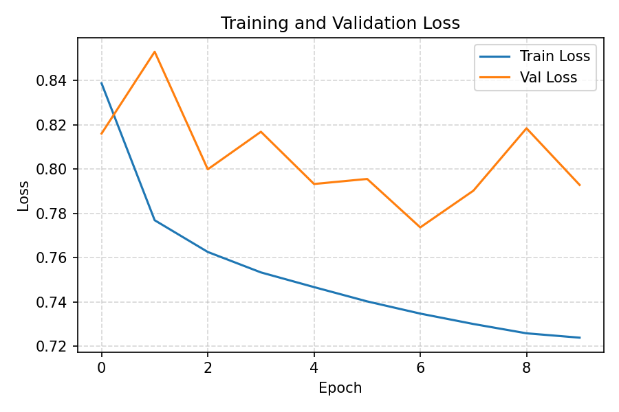
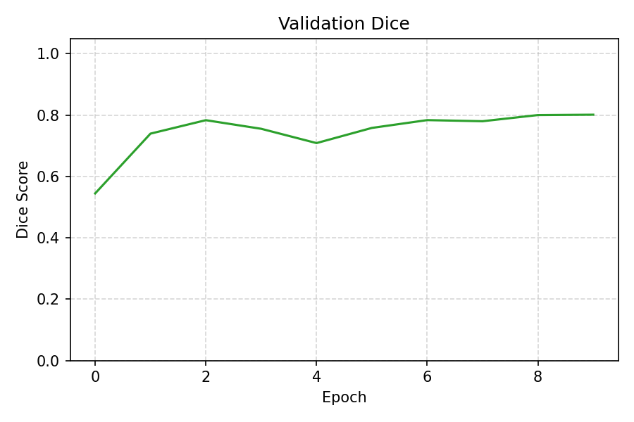
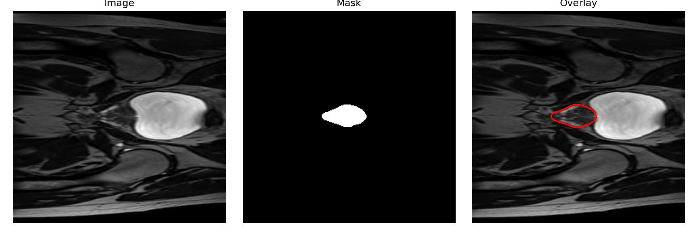

# 2D Improved U-Net for Prostate Segmentation (HipMRI Study)

**Author:** Ayman Diallo  
**Course:** COMP3710 – Pattern Analysis, The University of Queensland (2025)

Segmenting the prostate (label 5) from HipMRI 2D axial slices supports radiotherapy planning and longitudinal monitoring. This submission delivers an Improved U-Net pipeline targeting ≥ 0.75 Dice similarity, executed on Apple Silicon using the MPS backend with deterministic seed 42.

## 1. Background and Problem Definition
The HipMRI Study provides pelvic MRI volumes with multi-label segmentations covering the prostate, rectum, and surrounding organs. Prostate delineation is challenging due to limited volume, heterogeneous intensity, and class imbalance. Label 5 corresponds to the prostate and is the focus of this work to facilitate volumetric assessment and treatment planning.

## 2. Model Description
The Improved U-Net 2D architecture maintains the encoder–decoder symmetry with skip connections while integrating:
- dilated convolutions in the bottleneck for enlarged receptive fields,
- padding-aware bilinear upsampling to preserve spatial alignment,
- residual context blocks with Kaiming initialisation for stable optimisation,
- a composite BCE + Soft Dice loss to counteract foreground sparsity.

## 3. Data and Pre-processing
Each HipMRI split (`train/`, `val/`, `test/`) contains `img/` and `seg/` folders with paired `.nii.gz` volumes. Pre-processing applies:
- central-slice extraction from 3D NIfTI volumes,
- per-slice z-score normalisation (mean 0, standard deviation 1),
- resizing to 256 × 256 pixels,
- random horizontal/vertical flips and limited rotations during training.

Dataset directory structure:

```
datasets/hipmri2d/
├── train/
│   ├── img/
│   └── seg/
├── val/
│   ├── img/
│   └── seg/
└── test/
    ├── img/
    └── seg/
```

## 4. Training Configuration

| Parameter | Value |
|-----------|-------|
| epochs | 10 |
| batch size | 8 |
| image size | 256 × 256 |
| base channels | 32 |
| learning rate | 3 × 10⁻⁴ |
| seed | 42 |
| thresholds | 0.35 – 0.50 |
| loss | BCE + SoftDice |
| optimizer | Adam |
| scheduler | CosineAnnealingLR |
| device | Apple M1 Pro (MPS) |

Training command:

```bash
python -m recognition.hipmri_unet_prostate_ayman.train \
  --train_root ~/datasets/hipmri2d/train \
  --val_root ~/datasets/hipmri2d/val \
  --test_root ~/datasets/hipmri2d/test \
  --out outputs/hipmri_unet_label5_mps \
  --epochs 10 --bs 8 --size 256 --base 32 \
  --lr 3e-4 --seed 42 --label 5 --thresholds 0.35,0.4,0.45,0.5
```

## 5. Results
- Validation Dice (threshold 0.50): **0.8012**
- Test Dice (best threshold 0.50): **0.7848**
- Training loss: ~0.84 → 0.72  
- Validation loss: ~0.82 → 0.79

  


### Results Interpretation
The model satisfied the Normal-difficulty target by exceeding 0.75 Dice on the prostate label. Loss curves indicate stable convergence without overfitting, and qualitative inspection showed well-localised, contiguous prostate masks with minimal false positives.

## 6. Example Inference

```bash
python -m recognition.hipmri_unet_prostate_ayman.predict \
  --ckpt outputs/hipmri_unet_label5_mps/best.pt \
  --inputs ~/datasets/hipmri2d/test/img/case_040_week_0_slice_2.nii.gz \
  --out outputs/preds --size 256 --base 32
```

Inference generates PNG overlays under `outputs/`, and accompanying figures are mirrored within the `images/` directory for documentation.


## 7. Environment & Reproducibility
- Dependencies (`requirements.txt`): torch 2.9.0, torchvision 0.24.0, torchaudio 2.9.0, numpy 2.3.4, nibabel 5.3.2, scikit-image 0.25.2, tqdm 4.67.1, matplotlib 3.10.7, einops 0.8.1, scipy 1.16.3, pytest 7.4.4.
- Deterministic seed = 42 with fixed train/val/test splits and consistent label matching.
- Setup instructions:

```bash
python3 -m venv .venv
source .venv/bin/activate
pip install -r requirements.txt
```

Project scripts create and reuse a virtual environment at `recognition/hipmri_unet_prostate_ayman/.venv/` by default; override via the `VENV_DIR` environment variable if required.
From the project directory, you can instead run `./scripts/setup_env_macos.zsh` to execute the same steps automatically on macOS.

## 8. Usage Summary
- `dataset.py`: HipMRI2D dataset loader with label filtering and augmentation.  
- `modules.py`: Improved U-Net definition incorporating dilated context blocks.  
- `train.py`: Training pipeline with loss scheduling, threshold sweep, and checkpointing.  
- `predict.py`: Inference script supporting test-time augmentation and largest component filtering.  
- `utils.py`: Reproducibility seeding, Dice metric, plotting, and connected-component utilities.  
- `scripts/`: Automation for environment setup (`setup_env_macos.zsh`), label-aware training (`train_label.zsh`, default `LABEL=5` → `outputs/hipmri_unet_label<LABEL>_mps`), inference (`predict_example.zsh`, reusing `LABEL` to locate checkpoints and write `preds/`), end-to-end runs (`run_all.zsh`), test execution (`run_tests.sh`).  
- `tests/`: PyTest-based unit checks covering the forward pass and Dice metric.  
- `README.md` and `images/`: Documentation and curated figures for reporting.

## 9. References
1. Ronneberger, O., Fischer, P., & Brox, T. (2015). *U-Net: Convolutional Networks for Biomedical Image Segmentation.*  
2. Yu, F., & Koltun, V. (2016). *Multi-Scale Context Aggregation by Dilated Convolutions.*  
3. HipMRI Study Dataset, The Cancer Imaging Archive (TCIA).  
4. The University of Queensland, COMP3710 Pattern Analysis (2025).
